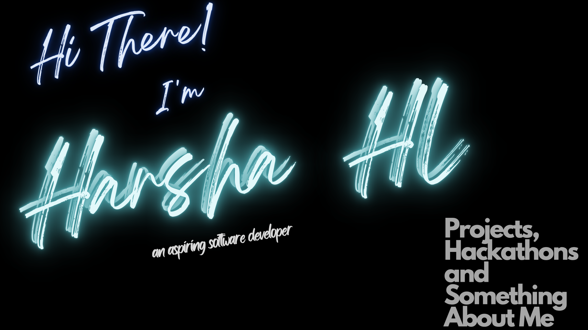

# Hello ! 

My name is Harsha HL and I'm an aspiring software developer. I'm from India, living in Bengaluru and am currently pursuing my bachelor's in computer science engineering at RVCE. You can find me on [Twitter](https://twitter.com/hl_harsha),  or on [LinkedIn](https://www.linkedin.com/in/harsha-hl-3b4b79208/).

## 🔧 Technologies & Tools

 
 

